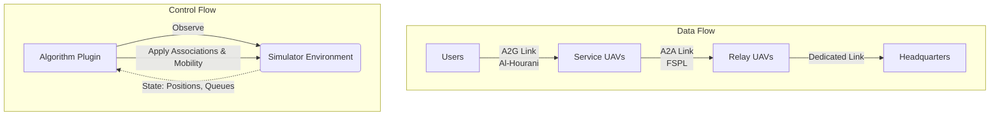

# Current Architecture Report

This report analyzes the existing multi-agent post-disaster UAV communication system simulator.

## Phase 1 — Repository Analysis

### Environment Implementation
- The environment is implemented as a custom discrete-time simulation loop in `core/simulator.py`.
- It uses a dual-clock architecture:
  - A control/macro step (e.g., 1s) for algorithm decisions (e.g., routing, mobility, scheduling associations).
  - A physics/micro step (e.g., 1ms) to simulate precise packet draining, channel conditions, and interference.
- Space is represented as a 3D coordinate system containing ground users, service UAVs, relay UAVs, and a Headquarters (HQ).

### Agent Implementation
- Agents and entities are defined in `entities/entities.py`.
- **User**: Ground entities that generate and queue data packets.
- **Service UAV**: Low-altitude drones that associate with users, collect their uplink traffic, and queue it for the backhaul.
- **Relay UAV**: High-altitude drones that associate with Service UAVs, aggregating backhaul traffic and forwarding it to the HQ.
- **HQ**: The final destination for all generated traffic.
- Agents maintain internal state (position, energy consumed) and implement a `PacketQueue` for data.

### Communication Model
- The channel model (`network/channel.py`) defines 3D distance and path loss computation.
- **Air-to-Ground (A2G)**: Uses the Al-Hourani Probabilistic Line-of-Sight (LoS) model, distinguishing between LoS and NLoS with different shadowing standard deviations.
- **Air-to-Air (A2A)**: Handled primarily via Free Space Path Loss (FSPL) with minor shadowing, assuming mostly LoS links.
- **Interference**: Calculated in `network/interference.py`. Power computations are handled in Watts before being converted to final dB representations to calculate SINR. Shannon Capacity derives the achievable bits per second.

### Task/Job Generation Logic
- Handled by `traffic/traffic.py` (`TrafficGenerator`).
- Users are spawned and expired to maintain a target population based on an exponential lifetime.
- Traffic generation follows a Poisson arrival process for packet counts and a Pareto distribution for packet sizes (modeling bursty network traffic).

### Queueing Logic
- Implemented in `traffic/queue.py` (`PacketQueue`).
- Each transmitting entity (User, Service UAV, Relay UAV) has a FIFO queue.
- Queues support dequeuing fractional packets (`remaining_bits`) based on the channel capacity achieved within a micro-timestep.
- Packets reset their `remaining_bits` back to `original_size_bits` when moving from one hop's queue to the next.

### Existing MARL Algorithms (Pluggable Algorithms)
Currently, the codebase provides heuristic baseline algorithms instead of trained MARL agents. They are designed as plug-ins (`algorithms/plugin.py`) implementing the `BaseAlgorithm` interface:
- **Schedulers (A2G)**:
  - `RoundRobinScheduler`
  - `MaxThroughputScheduler`
  - `ProportionalFairScheduler`
- **Routing (A2A)**:
  - `BestRelayRouting`: Connects Service UAVs to the Relay UAV providing the highest backhaul capacity.
- **Mobility**:
  - `StaticPositions`: All UAVs hover.
  - `DemandBasedMobility`: Service UAVs greedily move toward the center of mass of their assigned users.

### Observation Space
The base `observe(state)` function across algorithms receives a dictionary containing:
- `users`: List of active ground users (positions, queues).
- `service_uavs`: List of Service UAVs (positions, queues, energy).
- `relay_uavs`: List of Relay UAVs (positions, queues, energy).
- `interference_model`: To allow algorithms to sample hypothetical channel conditions.
- `current_time`: Simulation time.

### Action Space
Depending on the algorithm domain, the action space involves:
- **Scheduler**: Assigning users to service UAVs (macro) and picking an active user per micro-step.
- **Routing**: Assigning a Service UAV to a single Relay UAV.
- **Mobility**: Discrete movement commands (0: Hover, 1: North, 2: South, 3: East, 4: West).

### Reward Functions
While explicit RL reward functions are not defined, the performance is evaluated using global metrics in `metrics.py` and `experiments/runner.py`, which would serve as bases for rewards:
- **Throughput**: Total bits delivered over time.
- **Delay**: End-to-end packet delay distribution.
- **Fairness**: Jain's Fairness Index (JFI) of user throughputs.
- **Energy**: Total consumed energy by UAVs.
- **Packet Delivery Ratio (PDR)**: Delivered vs. Generated packets.

### Training Pipeline
- Currently absent. The existing pipeline in `experiments/runner.py` is purely an evaluation pipeline for running combinations of heuristics across multiple seeds and exporting timeseries metrics (CSV files) for plotting via `experiments/plot_results.py`.

## Diagram

